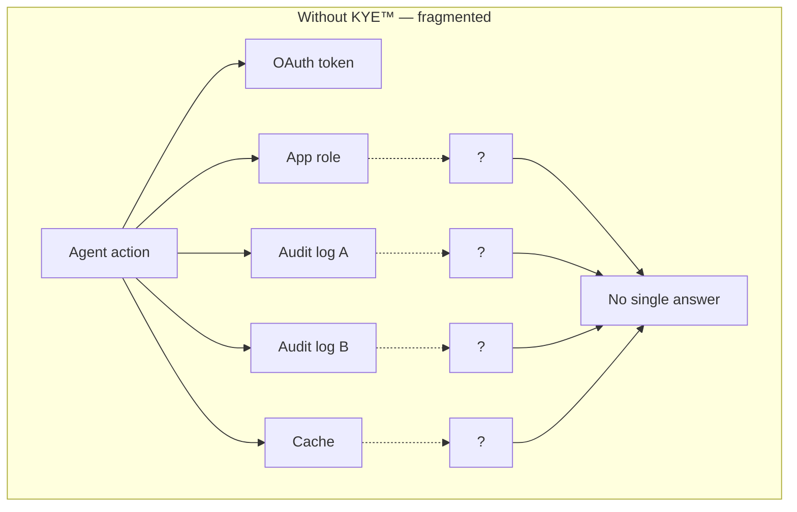
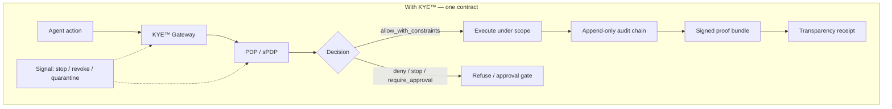
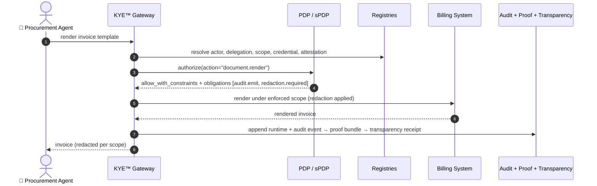
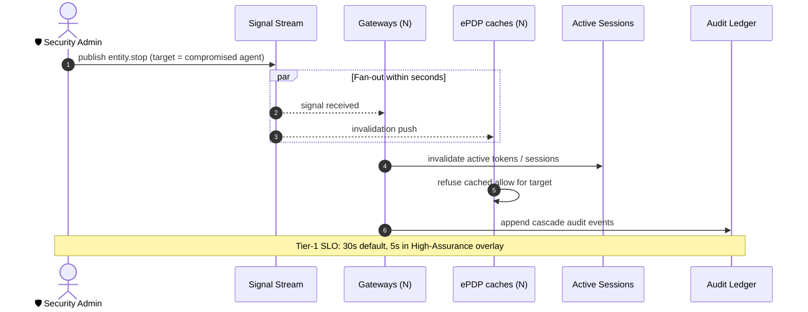
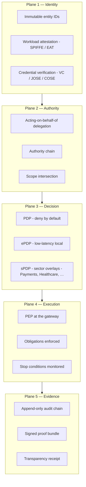
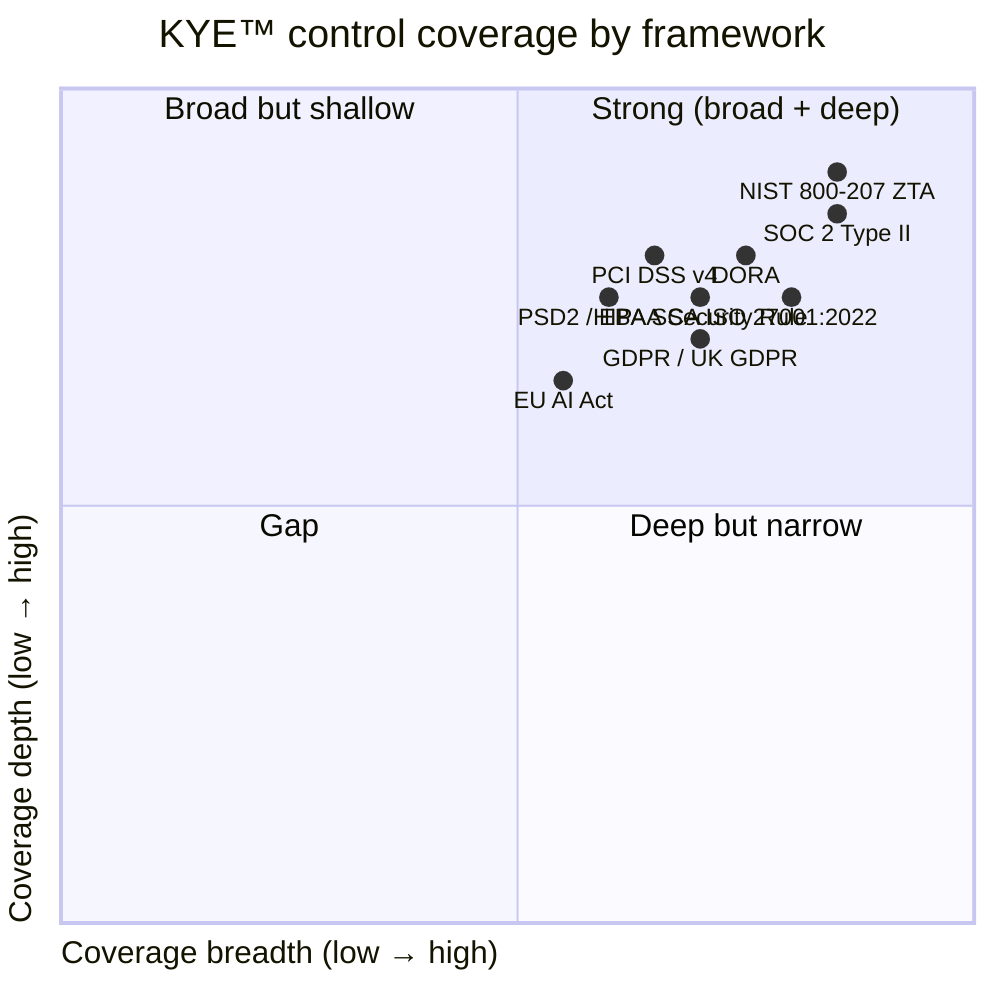
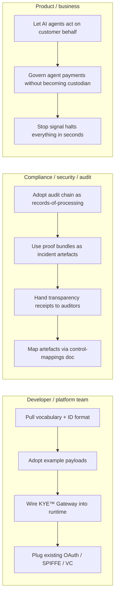

# KYE Protocol™

**KYE™ — Know Your Entity™.** An open vocabulary and contract layer for proving *who acted, on whose behalf, with what authority, under what scope, with what evidence* — for **every** action your humans, services, AI agents, models, tools, and workflows take.

> **KYC tells you who a customer is. KYB tells you who a counterparty is. KYE™ tells you who acted.**

---

## The problem

Modern systems are run by **a swarm of acting entities**: humans, service accounts, workloads, AI agents, models, tools, automations, third-party integrations. Every action one of them takes touches a different access-control silo, a different audit log, a different policy engine, a different revocation channel.

When something goes wrong — an agent drifts off-policy, a credential is compromised, a regulator asks "show me who did this and why" — the answers are scattered, partial, and unreplayable.

The result: **revoking an agent takes hours**, **proving what an agent did takes weeks**, and **auditing an AI workflow takes a project**.

## The solution

KYE™ unifies the answer. One immutable entity ID per actor. One acting-on-behalf-of delegation per scope. One policy decision per action. One signed audit chain per system. One signal that stops everything in seconds.

KYE™ is **not** a SaaS, **not** a replacement for OAuth / OIDC / SPIFFE / VC, **not** a custodian. It's the **contract layer** those things plug into so the entire system has consistent, replayable, signed accountability for every governed action.

---

## A day in the life — AI agent renders a finance invoice

Six months later, an auditor asks: *"Why was this rendered?"* — KYE™ replays the chain bit-identically, with a signed transparency receipt proving the chain hasn't been edited.

---

## A bad day in the life — agent compromise, stop cascade in seconds

No more *"we revoked the API key, please wait 24 hours for the cache to expire"*.

---

## What KYE™ does — twelve questions

For every governed action, KYE™ standardises how a system answers these — **every time, in a portable form**:

| # | Question | KYE™ artefact |
|---|---|---|
| 1 | Who is the actor? | immutable entity ID |
| 2 | On whose behalf is it acting? | delegation (subject) |
| 3 | By what authority? | delegation basis + delegator |
| 4 | With what credential or attestation? | credential + attestation refs |
| 5 | What right is being exercised? | action + access right |
| 6 | What scope bounds it? | scope (currency, jurisdiction, env, limits, data classes, obligations) |
| 7 | What resource is targeted? | resource entity ID |
| 8 | What policy decides? | policy bundle version |
| 9 | What obligations attach? | audit.emit, redaction.required, approval.required, … |
| 10 | What stop conditions apply? | delegation.revoked, credential.revoked, attestation.stale, … |
| 11 | What runtime event was emitted? | append-only runtime event |
| 12 | What proof exists? | signed proof bundle + transparency receipt |

If your system can't answer those twelve questions for every action it takes, you don't have entity-level accountability — you have logs. **KYE™ is the contract that turns logs into proof.**

---

## How it works — five planes

KYE™ specifies the contracts at each plane. Implementations choose their cloud, language, database, and policy engine.

---

## Who uses KYE™ — and why

| You are… | KYE™ gives you… |
|---|---|
| **A platform building AI agents that act for customers** | A way to prove every agent action was authorised, scoped, recorded, and revocable — without inventing the wiring yourself. |
| **A regulated SaaS provider** (fintech, health, gov, defense) | A pre-built evidence layer that maps directly onto SOC 2, ISO 27001, PCI DSS, PSD2, DORA, GDPR, HIPAA, NIST 800-207, and EU AI Act controls. |
| **A bank, fintech, or payments company** running agentic workflows | Wallet-bound spend control, dual-approval, signed payment attestations, and replayable proof of every payment authorisation — without becoming a custodian or settlement system. |
| **A security or audit team** | An append-only, hash-linked, signed audit chain plus signed transparency receipts that prove integrity without the auditor having to trust your database. |
| **A standards-aware identity team** | A protocol that **composes** with what you already use (OAuth, OIDC, SPIFFE, EAT, VC, JOSE/COSE, SCITT, GNAP, OpenID SSF/CAEP, OpenID Authorization API, OpenTelemetry) instead of replacing it. |
| **An AI-governance team** | Per-entity autonomy levels, mandatory signal-driven stop / revoke / quarantine cascades, and policy-decision records that satisfy EU AI Act records-of-processing requirements. |

---

## Compliance coverage at a glance

Each framework's specific controls are mapped to concrete KYE™ artefacts (schema fields, audit-chain entries, runtime event types, proof bundles). KYE™ is the **evidence layer** under the customer's certification — it is **not** itself a certification.

---

## Benefits at a glance

- **Stoppable agents.** Publish one signal; every Gateway, ePDP, and downstream PEP refuses the next call within seconds.
- **Replayable decisions.** Any policy decision can be reconstructed at any future date from the append-only chain — bit-identical, with a signed receipt.
- **Compliance evidence by construction.** The audit chain, proof bundles, and transparency receipts ARE the SOC 2 / ISO 27001 / PCI / DORA / HIPAA evidence. You don't generate evidence — it falls out of doing the work.
- **Acting-on-behalf-of as a first-class concept.** Delegations are explicit, scoped, time-bounded, revocable, recorded.
- **AI-native.** Models, prompt templates, guardrails, tools, and memory stores are first-class entities with classifications, attestations, and stop conditions. Autonomy modes are explicit.
- **Payments-ready, without becoming the bank.** Wallets, payment authorities, intents, approvals, and rail adapters are governed entities; **balances, settlement, custody, and clearing stay in your existing payment stack**.
- **Standards-composing, not replacing.** Bring your existing OAuth, OIDC, SPIFFE, VC, OpenAPI, OTEL pipelines.
- **Portable.** Cloud-agnostic, database-agnostic, language-agnostic.

---

## How users actually use KYE™

Three entry points, depending on your role.

### 1. Developer / platform team

You start by adopting the open vocabulary and wire contracts:

- Pull the [vocabulary](https://github.com/KYE-Protocol/vocabulary) — entity types, relationship types, action names, lifecycle states, obligations, data classes, reason codes
- Adopt the [ID format](https://github.com/KYE-Protocol/id-format) for every entity in your system
- Use the [examples](https://github.com/KYE-Protocol/examples) as starting templates

Wire a KYE-compliant Gateway into your runtime, pointed at your existing IdP, your existing policy engine, and your existing audit/observability stack. Existing OAuth tokens, SPIFFE workload identities, and W3C VC credentials all plug in.

### 2. Compliance / security / audit team

Start with the evidence story:

- The append-only audit chain is your records-of-processing register (GDPR Art. 30 / SOX / SOC 2 CC8.1)
- Proof bundles are your incident artefacts and your annual-audit handoff
- Transparency receipts are your tamper-detection signal you can point external auditors at
- The control-mappings document maps each KYE™ artefact to specific framework controls

You don't *instrument for compliance* — KYE™ artefacts **are** the compliance evidence.

### 3. Product / business team

Start with the risk-and-unlock story:

- *"Can I let an AI agent act on a customer's behalf?"* → yes, with explicit delegation, scope, attestation, and revocation
- *"Can I let an agent move money?"* → yes, under wallet-bound spend control, dual approval, and signed payment attestations
- *"What if the agent goes rogue?"* → publish a stop signal; the cascade quarantines the agent, invalidates active tokens, blocks pending workflows, all within seconds

---

## What's public, what's reserved

| Asset | License |
|---|---|
| Vocabulary, ID format, illustrative examples | **Apache 2.0** — use freely |
| Documentation prose | **CC BY 4.0** where indicated |
| Trademarks (KYE™, KYE Protocol™, KYE™ Gateway™, KYE Payments™, KYE Certified™) | reserved |
| Reference runtimes and SDKs | published under their own terms |
| Mechanism specifications | not published in this repository — see Patent notice below |

The Apache 2.0 grant **does not** include trademark rights. To indicate conformance, participate in the **KYE Certified™** program.

---

## Public repositories

| Repository | Contents |
|---|---|
| [`vocabulary`](https://github.com/KYE-Protocol/vocabulary) | Stable names: entity types, relationships, actions, lifecycle states, obligations, data classes, reason codes |
| [`id-format`](https://github.com/KYE-Protocol/id-format) | KYE™ URN identifier format |
| [`examples`](https://github.com/KYE-Protocol/examples) | Illustrative JSON example payloads (every public schema covered) |

These three repositories are sufficient to **discuss, name, and tool against** KYE™. Implementing a conformant runtime requires the normative specification, which is published on a separate track.

---

## Profile family

KYE™ is a family of profiles, not a monolith.

| Profile | Purpose |
|---|---|
| **KYE-Core™** | Entity model, lifecycle, delegation, scope, decision, audit, proof |
| **KYE-Gateway™** | Runtime enforcement (PEP) and interoperability |
| **KYE-Federation™** | Cross-domain trust + entity transfer |
| **KYE-Credentials™** | Credential / presentation packaging (VC + JOSE/COSE) |
| **KYE-Attestation™** | Workload + entity attestation (SPIFFE + EAT) |
| **KYE-Signals™** | Continuous risk / revocation signaling (SSF/CAEP-compatible) |
| **KYE-Transparency™** | Signed statements + inclusion-proof receipts (SCITT-style) |
| **KYE-Telemetry™** | Observability semantic conventions (OTEL) |
| **KYE-Conformance™** | Machine-testable rules + KYE Certified™ program |
| **KYE-Payments™** | Wallets, payment authorities, intents, approvals, rail adapters |
| **KYE-Treasury™** *(overlay)* | Spend programs, allocation, payout batches |
| **KYE-Custody™** *(overlay)* | Custody-provider binding + signing-policy + key ceremonies |
| **KYE-Healthcare™** *(overlay)* | HIPAA + HITECH (break-glass, patient consent, ePHI) |
| **KYE-Payments-EU™** *(overlay)* | PSD2 + EBA SCA RTS |
| **KYE-Payments-Card™** *(overlay)* | PCI DSS v4 |
| **KYE-Payments High-Assurance™** *(overlay)* | Maximum-strictness payments stack |

---

## Standards alignment

KYE™ coexists with — does not replace — the standards you already trust:

- **NIST SP 800-207 Zero Trust Architecture** — KYE™ is the resource-centric posture
- **OAuth 2.0 / OIDC / GNAP** — token issuance + delegated authorization
- **OpenID Authorization API** — PDP / PEP exchange compatible
- **OpenID Shared Signals Framework / CAEP** — signal interop
- **SPIFFE / SVID** — workload identity bridge
- **IETF EAT (RFC 9711)** — attestation claim format
- **W3C VC 2.0 + JOSE/COSE** — credential securing
- **SCITT** — transparency receipts
- **OpenTelemetry semantic conventions** — observability vocabulary

---

## What KYE™ is not

- not a SaaS product
- not a replacement for OAuth, OIDC, SPIFFE, EAT, VC, or SCITT
- not a custodian, processor, ledger, or settlement system
- not an opinionated cloud, database, language, or model

---

## Patent notice

KYE Protocol™ is the subject of pending patent applications. The public repositories deliberately publish only the **vocabulary, naming, and high-level structure**, and do not publish the specific algorithms used to implement the protocol's mechanism layer. Anyone interested in implementing a conformant runtime should contact the maintainers about the normative specification track and the **KYE Certified™** conformance program.

---

## Get involved

- **Use** the vocabulary, ID format, and examples in your own tooling under Apache 2.0
- **Discuss** naming and vocabulary in the issues of the relevant public repository
- **Conformance** — contact the maintainers about the **KYE Certified™** program
- **Specification access** — contact the maintainers about the normative specification track

For collaboration, conformance program participation, or normative specification access, contact the KYE Protocol™ maintainers.

---

KYE™, KYE Protocol™, KYE Passport™, KYE™ Gateway™, KYE Payments™, KYE Certified™, Know Your Entity™ and the KYE™ logo are trademarks of the KYE Protocol™ maintainers. Use of these marks to indicate conformance requires participation in the KYE Certified™ program.
